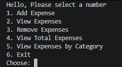
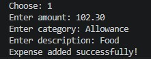
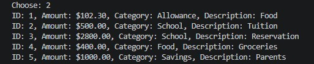
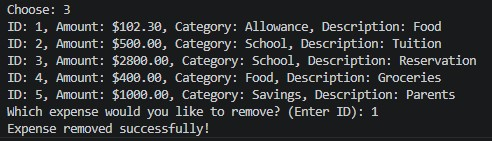
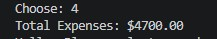
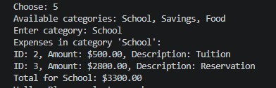

# Expense Tracker

A command-line expense tracker built in Python.

## Features
- Adding expenses with amount, category, and description
- Viewing expenses with designated ID, amount, category, and description
- Removing expenses by their designated ID
- Viewing the total amount of the expenses
- Viewing the expenses by their designated Category
- Saving the expenses in a JSON file
- Unique ID assigned to each expense
- If there are no expenses, ID starts at 1. But if there are, the next ID would be plus 1 of the highest existing ID.
- Input validation for amounts

## How to Run
- Make sure Python is installed
- Run: python expensetracker.py

## What I learned
- I learned JSON file handling in order to save and load data (expenses) using "json.dump()" and "json.
-I learned how to define and organize code into functions and reusable blocks, each responsible for one specific task such as Adding, Removing, Viewing, Getting the Total, and Viewing by Category.
- I learned Loops and conditionals such as while True to keep asking for a valid input. 
- The if/elif/else for user choices.
- I learned to store expense as dictionaries inside a list, and then using sets to collect their categories.
- If there are invalid user input, we handle it and avoid for the program from crashing.
- I also learned Git and GitHub — adding, committing, and pushing my code for the first time.
- I also learned global and local variables and when to use them.

## Preview

